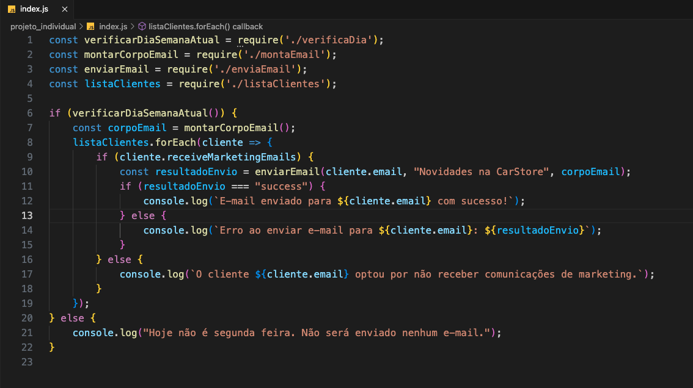
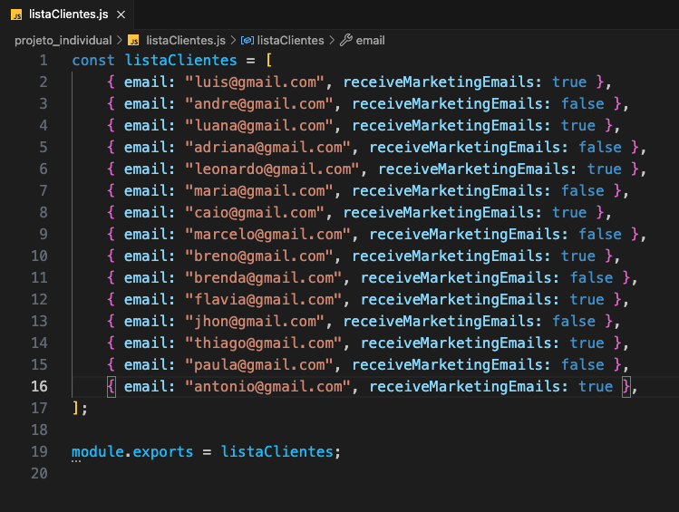
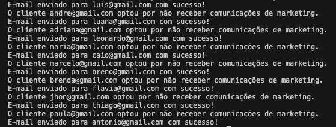

# ADA Tech - módulo 2 - Projeto Individual

## Sobre o projeto

Construir a funcionalidade de enviar um e-mail, todas as segundas-feiras, para os clientes que visitaram a loja de carros (CarStore), informando-os sobre os novos veículos e os mais vendidos, bem como as condições para aquisição

  

  

  

## Funcionalidades
- Verificar dia da semana para enviar os e-mails às segundas;
- Montar o corpo do e-mail;
- Lista de e-mails dos clientes com "true" para os que querem receber e-mail e "false" para os que não querem;
- Função para enviar o e-mail com um randômico para simular erro de envio em alguns emails;

## Requisitos

- Node.js;
- Para rodar o projeto basta, com o node instalado, com o terminal na parta do projeto, digitar o comando `node index.js`.
- Caso não seja uma segunda feira e queira rodar o projeto simulando o envio dos e-mails, basta, no arquivo `verificaDia.js` comentar o primeiro `return` e tirar o segundo `return` da forma de comentário.